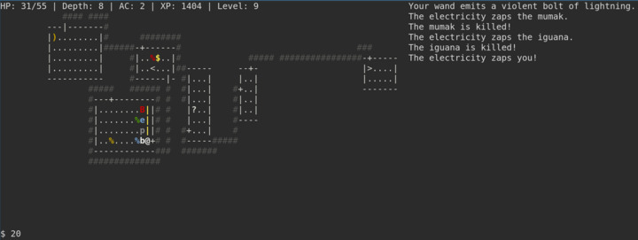

# Ascend 
**Venture into the depths to retrieve the stolen artifact,
and ascend!**



A simple, yet fun terminal RPG. NetHack lite.

### Get it!
```bash
opam install ascend 
```
Launch with: `ascend`

In-game help: `?`

### Development
#### Running:
`dune exec ascend`

#### Compiling:
`dune build`

### Why have you done this?
It started with *Wonder how hard it would be to...*\
And kept continuing with *But wouldn't it be nice if...*\
Until it got to *Might as well make it into something nice.*
